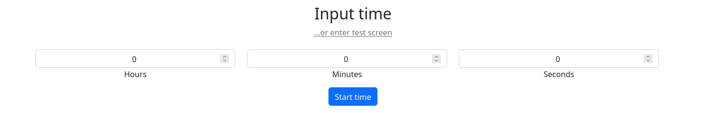
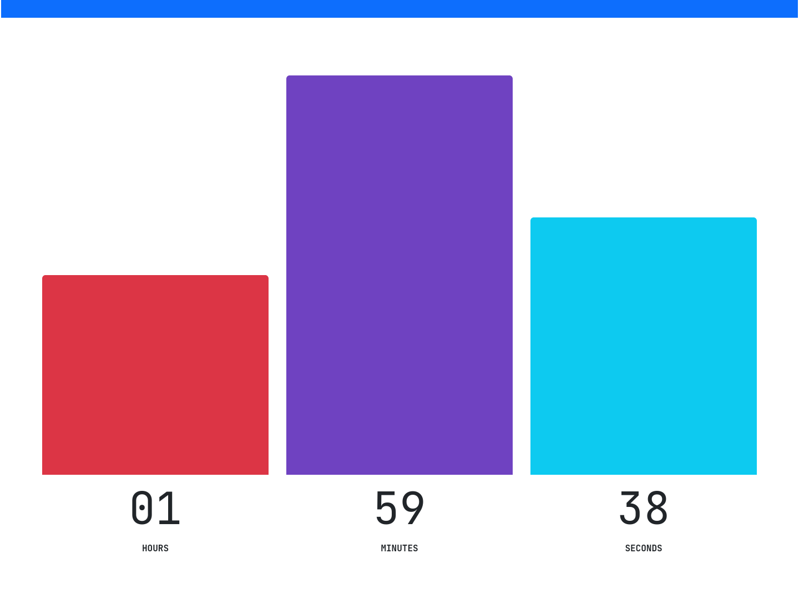
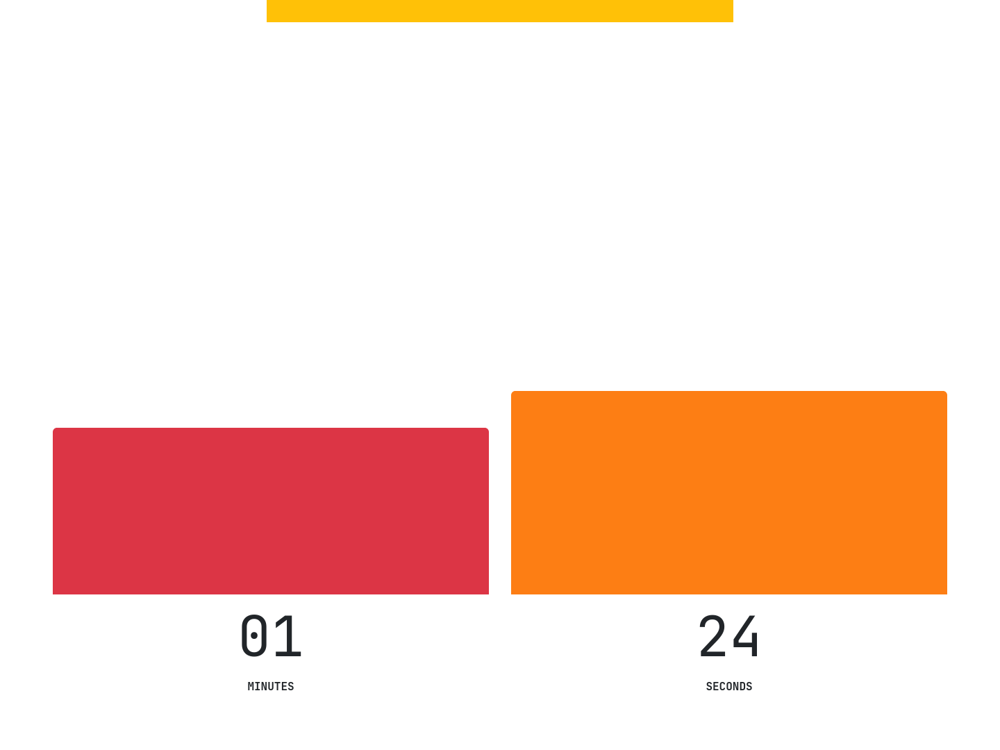

# Fancy Countdown

[](https://developer.mozilla.org/en-US/docs/Web/JavaScript)
[](https://getbootstrap.com/)
[](https://webpack.js.org/)
[](https://webpack.js.org/)
[](https://webpack.js.org/)
[](https://webpack.js.org/)

Provide a time (up to a day) and it will count to 0!







## Building

Install dependencies:

```
npm install -D
```

Run build script:

```
npm run build
```

## Running locally

Run live server script:

```
npm start
```
